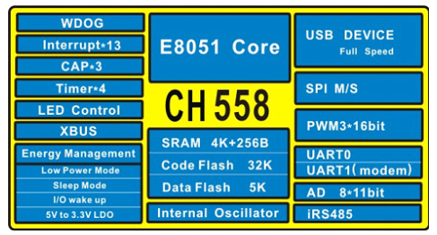
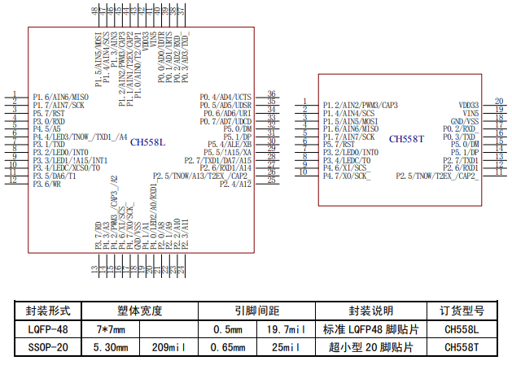

# [CH558](https://github.com/sochub/CH558) 

 

#### [Vendor](https://github.com/sochub/Vendor)：[WCH](https://github.com/sochub/WCH)
#### [Core](https://github.com/sochub/8051)：[E8051](https://github.com/sochub/8051)
#### [Level](https://github.com/sochub/Level)：12/56MHz

## [简介](https://github.com/sochub/CH558/wiki)

[CH558](https://github.com/sochub/CH558) 是一款兼容MCS51指令集的增强型E8051内核单片机，79%的指令是单字节单周期指令，内置32K CodeFlash，4K+256B Ram。

CH558内嵌USB全速收发器，支持USB-Device 设备模式，支持 USB 2.0全速 12Mbps或者低速 1.5Mbps。支持最大 64字节数据包，内置 FIFO，支持 DMA。

CH558提供丰富的接口资源，包括内置类485数据收发器、LED控制卡接口和快速电平捕捉功能，其他包括1组SPI、2路串口、8位并口等，UART1兼容16C550；内置4组定时器；提供1路16位PWM；支持8通道10/11位ADC。

 

* 芯片封装：LQFP48、SSOP20

 

### [资源收录](https://github.com/sochub)

* [参考文档](docs/)
* [参考资源](src/)

#### [外部资源](https://github.com/sochub)

* [OS-Q H05](https://github.com/OS-Q/H05)
* [编译器SDCC](https://github.com/sochub/sdcc)

### [选型建议](https://github.com/sochub)

[CH558](https://github.com/sochub/CH558)配置接近[CH559](https://github.com/sochub/CH559)，之下还有[CH549](https://github.com/sochub/CH549)、[CH547](https://github.com/sochub/CH547)，[CH554](https://github.com/sochub/CH554)等产品。

###  [SoC资源平台](http://www.qitas.cn)

