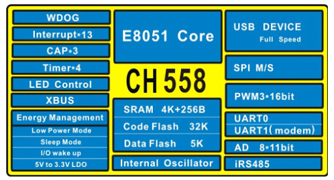

# [CH558](https://github.com/sochub/CH558) 

 

####  qitas@qitas.cn

#### 父级：[WCH-8051](https://github.com/sochub/WCH-8051) 
#### 归属：[MCS-51](https://github.com/sochub/MCS-51) 

## [简介](https://github.com/sochub/CH558/wiki)

CH558是一款兼容MCS51指令集的增强型E8051内核单片机，79%的指令是单字节单周期指令，内置32K CodeFlash，4K+256B Ram。

CH558内嵌USB全速收发器，支持USB-Device 设备模式，支持 USB 2.0全速 12Mbps或者低速 1.5Mbps。支持最大 64字节数据包，内置 FIFO，支持 DMA。

CH558提供丰富的接口资源，包括内置类485数据收发器、LED控制卡接口和快速电平捕捉功能，其他包括1组SPI、2路串口、8位并口等，UART1兼容16C550；内置4组定时器；提供1路16位PWM；支持8通道10/11位ADC。

 

## [组成](https://github.com/sochub/CH558)

#### [文档](docs/)

#### [资源](src/)

#### [工程](project/)

### [相似产品](https://github.com/sochub/CH558)

- [CH554](https://github.com/sochub/CH554) 

- [CH552](https://github.com/sochub/CH552) 

##  [SoC开发平台](http://www.qitas.cn)  

