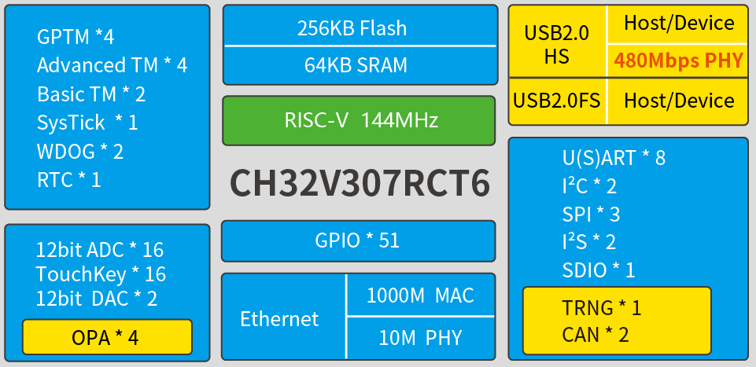

# [CH32V307](https://doc.soc.xin/CH32V307)

* [WCH](http://www.wch.cn/)：[RISC-V4C](https://github.com/SoCXin/RISC-V)
* [L2R3](https://github.com/SoCXin/Level)：144 MHz , [LQFP-64 ￥14.63](https://item.szlcsc.com/3443981.html)

## [简介](https://github.com/SoCXin/CH32V307/wiki)

[CH32V307](https://www.wch.cn/products/CH32V307.html) 系列是基于32位RISC-V设计的互联型微控制器，配备了硬件堆栈区、快速中断入口，在标准RISC-V基础上大大提高了中断响应速度。加入单精度浮点指令集，扩充堆栈区，具有更高的运算性能。扩展串口U(S)ART数量到8组，电机定时器到4组。提供USB2.0高速接口（480Mbps）并内置了PHY收发器，以太网MAC升级到千兆并集成了10M-PHY模块。

### 关键特性

* 144MHz RISC-V4C Core (RV32IMAC)
* 64KB SRAM + 256KB Flash (最大支持128KB SRAM)
* USB2.0全速OTG接口
* USB2.0高速主机/设备接口（480Mbps 内置PHY）
* 3个USART接口和5个UART接口
* 2个CAN接口（2.0B主动）
* 千兆以太网控制器ETH（内置10M PHY）
* 2组18路通用DMA
* 4组运放比较器
* 2组12位DAC转换
* 2单元16通道12位ADC转换，16路触摸按键TouchKey
* 10组定时器
* SDIO接口、FSMC接口、DVP数字图像接口
* 2组IIC接口、3组SPI接口、2组IIS接口

## [资源收录](https://github.com/SoCXin)

* [参考资源](src/)
* [参考文档](docs/)
* [参考工程](project/)

## [选型建议](https://github.com/SoCXin)

[CH32V307](https://github.com/SoCXin/CH32V307) 外设较多，适用于多路通信。

相较而言，去掉以太网、降低UART数量的版本[CH32V305RBT6](https://item.szlcsc.com/5860927.html)具有价格优势。

[应用优化系列](https://www.wch.cn/products/productsCenter/mcuInterface?categoryId=75)
